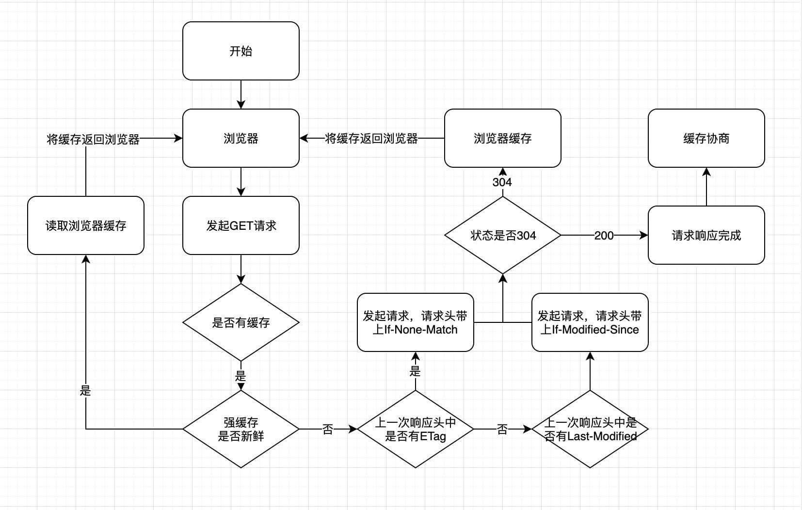

#### 1）浏览器缓存策略

浏览器每次发起请求时，先在本地缓存中查找结果以及缓存标识，根据缓存标识来判断是否使用本地缓存。如果缓存有效，则使
用本地缓存；否则，则向服务器发起请求并携带缓存标识。根据是否需向服务器发起HTTP请求，将缓存过程划分为两个部分：
强制缓存和协商缓存，强缓优先于协商缓存。

强缓存，服务器通知浏览器一个缓存时间，在缓存时间内，下次请求，直接用缓存，不在时间内，执行比较缓存策略。
协商缓存，让客户端与服务器之间能实现缓存文件是否更新的验证、提升缓存的复用率，将缓存信息中的Etag和Last-Modified
通过请求发送给服务器，由服务器校验，返回304状态码时，浏览器直接使用缓存。
HTTP缓存都是从第二次请求开始的：

第一次请求资源时，服务器返回资源，并在response header中回传资源的缓存策略；
第二次请求时，浏览器判断这些请求参数，击中强缓存就直接200，否则就把请求参数加到request header头中传给服务器，看是否击中协商缓存，击中则返回304，否则服务器会返回新的资源。这是缓存运作的一个整体流程图：

#### 2）强缓存

强缓存命中则直接读取浏览器本地的资源，在network中显示的是from memory或者from disk
控制强制缓存的字段有：Cache-Control（http1.1）和Expires（http1.0）
Cache-control是一个相对时间，用以表达自上次请求正确的资源之后的多少秒的时间段内缓存有效。
Expires是一个绝对时间。用以表达在这个时间点之前发起请求可以直接从浏览器中读取数据，而无需发起请求
Cache-Control的优先级比Expires的优先级高。前者的出现是为了解决Expires在浏览器时间被手动更改导致缓存判断错误的问题。
如果同时存在则使用Cache-control。

#### 3）强缓存-expires

该字段是服务器响应消息头字段，告诉浏览器在过期时间之前可以直接从浏览器缓存中存取数据。

Expires 是 HTTP 1.0 的字段，表示缓存到期时间，是一个绝对的时间 (当前时间+缓存时间)。在响应消息头中，设置这个字段之后，就可以告诉浏览器，在未过期之前不需要再次请求。

由于是绝对时间，用户可能会将客户端本地的时间进行修改，而导致浏览器判断缓存失效，重新请求该资源。此外，即使不考虑修改，时差或者误差等因素也可能造成客户端与服务端的时间不一致，致使缓存失效。

优势特点

1、HTTP 1.0 产物，可以在HTTP 1.0和1.1中使用，简单易用。
2、以时刻标识失效时间。
劣势问题

1、时间是由服务器发送的(UTC)，如果服务器时间和客户端时间存在不一致，可能会出现问题。
2、存在版本问题，到期之前的修改客户端是不可知的。

#### 4）强缓存-cache-control

已知Expires的缺点之后，在HTTP/1.1中，增加了一个字段Cache-control，该字段表示资源缓存的最大有效时间，在该时间内，客户端不需要向服务器发送请求。

这两者的区别就是前者是绝对时间，而后者是相对时间。下面列举一些 Cache-control 字段常用的值：(完整的列表可以查看MDN)

max-age：即最大有效时间。
must-revalidate：如果超过了 max-age 的时间，浏览器必须向服务器发送请求，验证资源是否还有效。
no-cache：不使用强缓存，需要与服务器验证缓存是否新鲜。
no-store: 真正意义上的“不要缓存”。所有内容都不走缓存，包括强制和对比。
public：所有的内容都可以被缓存 (包括客户端和代理服务器， 如 CDN)
private：所有的内容只有客户端才可以缓存，代理服务器不能缓存。默认值。
Cache-control 的优先级高于 Expires，为了兼容 HTTP/1.0 和 HTTP/1.1，实际项目中两个字段都可以设置。

该字段可以在请求头或者响应头设置，可组合使用多种指令：

可缓存性：
public：浏览器和缓存服务器都可以缓存页面信息
private：default，代理服务器不可缓存，只能被单个用户缓存
no-cache：浏览器器和服务器都不应该缓存页面信息，但仍可缓存，只是在缓存前需要向服务器确认资源是否被更改。可配合private，
过期时间设置为过去时间。
only-if-cache：客户端只接受已缓存的响应
到期
max-age=：缓存存储的最大周期，超过这个周期被认为过期。
s-maxage=：设置共享缓存，比如can。会覆盖max-age和expires。
max-stale[=]：客户端愿意接收一个已经过期的资源
min-fresh=：客户端希望在指定的时间内获取最新的响应
stale-while-revalidate=：客户端愿意接收陈旧的响应，并且在后台一部检查新的响应。时间代表客户端愿意接收陈旧响应
的时间长度。
stale-if-error=：如新的检测失败，客户端则愿意接收陈旧的响应，时间代表等待时间。
重新验证和重新加载
must-revalidate：如页面过期，则去服务器进行获取。
proxy-revalidate：用于共享缓存。
immutable：响应正文不随时间改变。
其他
no-store：绝对禁止缓存
no-transform：不得对资源进行转换和转变。例如，不得对图像格式进行转换。
优势特点

1、HTTP 1.1 产物，以时间间隔标识失效时间，解决了Expires服务器和客户端相对时间的问题。
2、比Expires多了很多选项设置。
劣势问题

1、存在版本问题，到期之前的修改客户端是不可知的。3

#### 5）协商缓存

协商缓存的状态码由服务器决策返回200或者304
当浏览器的强缓存失效的时候或者请求头中设置了不走强缓存，并且在请求头中设置了If-Modified-Since 或者 If-None-Match 的时候，会将这两个属性值到服务端去验证是否命中协商缓存，如果命中了协商缓存，会返回 304 状态，加载浏览器缓存，并且响应头会设置 Last-Modified 或者 ETag 属性。
对比缓存在请求数上和没有缓存是一致的，但如果是 304 的话，返回的仅仅是一个状态码而已，并没有实际的文件内容，因此 在响应体体积上的节省是它的优化点。
协商缓存有 2 组字段(不是两个)，控制协商缓存的字段有：Last-Modified/If-Modified-since（http1.0）和Etag/If-None-match（http1.1）
Last-Modified/If-Modified-since表示的是服务器的资源最后一次修改的时间；Etag/If-None-match表示的是服务器资源的唯一标
识，只要资源变化，Etag就会重新生成。
Etag/If-None-match的优先级比Last-Modified/If-Modified-since高。

#### 6）协商缓存-协商缓存-Last-Modified/If-Modified-since

1.服务器通过 Last-Modified 字段告知客户端，资源最后一次被修改的时间，例如 Last-Modified: Mon, 10 Nov 2018 09:10:11 GMT
2.浏览器将这个值和内容一起记录在缓存数据库中。
3.下一次请求相同资源时时，浏览器从自己的缓存中找出“不确定是否过期的”缓存。因此在请求头中将上次的 Last-Modified 的值写入到请求头的 If-Modified-Since 字段
4.服务器会将 If-Modified-Since 的值与 Last-Modified 字段进行对比。如果相等，则表示未修改，响应 304；反之，则表示修改了，响应 200 状态码，并返回数据。
优势特点
1、不存在版本问题，每次请求都会去服务器进行校验。服务器对比最后修改时间如果相同则返回304，不同返回200以及资源内容。
劣势问题
2、只要资源修改，无论内容是否发生实质性的变化，都会将该资源返回客户端。例如周期性重写，这种情况下该资源包含的数据实际上一样的。
3、以时刻作为标识，无法识别一秒内进行多次修改的情况。 如果资源更新的速度是秒以下单位，那么该缓存是不能被使用的，因为它的时间单位最低是秒。
4、某些服务器不能精确的得到文件的最后修改时间。
5、如果文件是通过服务器动态生成的，那么该方法的更新时间永远是生成的时间，尽管文件可能没有变化，所以起不到缓存的作用。

#### 7）协商缓存-Etag/If-None-match

为了解决上述问题，出现了一组新的字段 Etag 和 If-None-Match
Etag 存储的是文件的特殊标识(一般都是 hash 生成的)，服务器存储着文件的 Etag 字段。之后的流程和 Last-Modified 一致，只是 Last-Modified 字段和它所表示的更新时间改变成了 Etag 字段和它所表示的文件 hash，把 If-Modified-Since 变成了 If-None-Match。服务器同样进行比较，命中返回 304, 不命中返回新资源和 200。
浏览器在发起请求时，服务器返回在Response header中返回请求资源的唯一标识。在下一次请求时，会将上一次返回的Etag值赋值给If-No-Matched并添加在Request Header中。服务器将浏览器传来的if-no-matched跟自己的本地的资源的ETag做对比，如果匹配，则返回304通知浏览器读取本地缓存，否则返回200和更新后的资源。
Etag 的优先级高于 Last-Modified。
优势特点
1、可以更加精确的判断资源是否被修改，可以识别一秒内多次修改的情况。
2、不存在版本问题，每次请求都回去服务器进行校验。
劣势问题
1、计算ETag值需要性能损耗。
2、分布式服务器存储的情况下，计算ETag的算法如果不一样，会导致浏览器从一台服务器上获得页面内容后到另外一台服务器上进行验证时现ETag不匹配的情况。