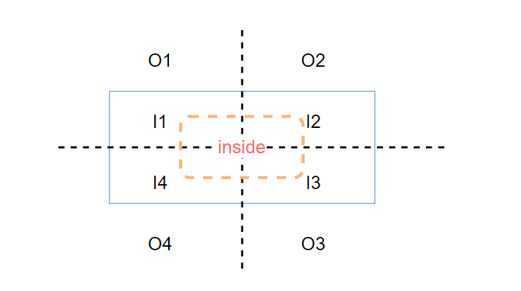

### 可视化拖拽文档

* 设计背景

  现有的拖拽功能不足:

1. 拖拽出来的组件只有红框没有具体的样式;
2. 拖拽过程中无法实时看到效果,需要松开鼠标后才能看到;
3. 现有拖拽的排序功能简单,只能进行简单的左右排序,无法做到上下排序等;

* 设计期望

1. 拖拽出来的组件显示组件的具体样式;
2. 拖拽过程中,实时显示放置后的效果;
3. 支持上下,左右排序,插入排序,拖入容器内的功能;

* 设计实现

<b>以下只适用于相对定位拖拽</b>

1. 列表拖拽开始,按照组件配置生成红框大小,将组件对应的图片插入到红框内,模拟组件实际效果;
   注: 这里用图片不用真实dom渲染是因为复杂的组件初始渲染时间过长会造成拖拽卡顿,且直接渲染要去除组件自带的定位,边距等属性,复杂度高;

2. 已渲染的组件拖拽时,直接拷贝所选中组件的dom放到红框中;
3. 组件拖拽中与已渲染的组件进行实时比较,按照拖拽算法,实时将对应的dom插入到最终渲染的位置并记录相关数据;
4. 释放鼠标,拖拽结束,根据操作数据操作items进行实际渲染;

* 拖拽算法实现

算法原理
1. 将拖拽元素和放置元素都抽象成一个矩形;

        class Rect {
          x: number
          y: number
          width: number
          height: number
          constructor(x: number, y: number, width: number, height: number) {
            this.x = x
            this.y = y
            this.width = width
            this.height = height
          }
          left() {
            return this.x
          }
          right() {
            return this.x - this.width
          }
          top() {
            return this.y
          }
          bottom() {
            return this.y - this.height
          }
        }

2. 矩形与矩形有相交与不相交两种关系;

        isCrossRectInRect(target: IRect, source: IRect) {
          const targetCenterPoint = new Point(
            target.x + target.width / 2,
            target.y + target.height / 2
          )
          const sourceCenterPoint = new Point(
            source.x + source.width / 2,
            source.y + source.height / 2
          )
          return (
            Math.abs(targetCenterPoint.x - sourceCenterPoint.x) <=
              target.width / 2 + source.width / 2 &&
            Math.abs(targetCenterPoint.y - sourceCenterPoint.y) <=
              target.height / 2 + source.height / 2
          )
        }

3. 相交根据源矩形的左上角坐标落在目标矩形的位置可以细分8个位置;

        isPointInRect(point: IPoint, rect: IRect) {
          return (
            point.x >= rect.x &&
            point.x <= rect.x + rect.width &&
            point.y >= rect.y &&
            point.y <= rect.y + rect.height
          )
        }
        enum RectQuadrant {
          Inner1 = 'I1', //内部第一象限
          Inner2 = 'I2', //内部第二象限
          Inner3 = 'I3', //内部第三象限
          Inner4 = 'I4', //内部第四象限
          Outer1 = 'O1', //外部第一象限
          Outer2 = 'O2', //外部第二象限
          Outer3 = 'O3', //外部第三象限
          Outer4 = 'O4', //外部第四象限
        }
        calcQuadrantOfPointToRect(point: IPoint, rect: IRect) {
          const isInner = isPointInRect(point, rect)
          if (point.x <= rect.x + rect.width / 2) {
            if (point.y <= rect.y + rect.height / 2) {
              if (isInner) {
                return RectQuadrant.Inner1
              } else {
                return RectQuadrant.Outer1
              }
            } else {
              if (isInner) {
                return RectQuadrant.Inner4
              } else {
                return RectQuadrant.Outer4
              }
            }
          } else {
            if (point.y <= rect.y + rect.height / 2) {
              if (isInner) {
                return RectQuadrant.Inner2
              } else {
                return RectQuadrant.Outer2
              }
            } else {
              if (isInner) {
                return RectQuadrant.Inner3
              } else {
                return RectQuadrant.Outer3
              }
            }
          }
        }

4. 根据鼠标移动X,Y轴运动的距离对比可以得出鼠标的移动方向,根据鼠标方向和拖入目标组件的布局方式判断排序的方向;

        const { x, y } = event
        const mouseDirection = Math.abs(x - this.lastPosition.x) > Math.abs(y - this.lastPosition.y) ? 'horizontal' : 'vertical'
        this.lastPosition = { x: x, y: y }

        const left = ['I1', 'I4', 'O1', 'O4']
        const right = ['I2', 'I3', '03', '04']
        const top = ["I1','I2',‘01','02"]
        const bottom = ['I3', 'I4', '03', '04']
        const quadrant = calcQuadrantOfPointToRect(point,rect) //相交象限
        const direction = getEleDirection(ele) // 元素的布局方式

        if (direction === 'horizontal' && mouseDirection === 'horizontal') {//水平布局，左右移动
          if (left.includes(quadrant)) {
            insertBefore() // 向前插入
          }
          else if (right.includes(quadrant)) {
            insertAfter() // 向后插入
          }
        } else if (direction === 'vertical' && mouseDirection === 'vertical') {//垂直布局,上下移动
          if (top.includes(quadrant)) {
            insertBefore() 
          }
          else if (bottom.includes(quadrant)) {
            insertAfter()
          }
        }

5. 相交的情况还有一种特殊的关系就是包含,包含关系可以用于进行层级拖拽

        getRectPoints(source: IRect) {
          const p1 = new Point(source.x, source.y)
          const p2 = new Point(source.x + source.width, source.y)
          const p3 = new Point(source.x + source.width, source.y + source.height)
          const p4 = new Point(source.x, source.y + source.height)
          return [p1, p2, p3, p4]
        }
        isRectInRect(target: IRect, source: IRect) {
          const [p1, p2, p3, p4] = getRectPoints(target)
          return (
            isPointInRect(p1, source, false) &&
            isPointInRect(p2, source, false) &&
            isPointInRect(p3, source, false) &&
            isPointInRect(p4, source, false)
          )
        }

6. 因为有时需要把大的容器拖入到小的容器中,但是这样是不会触发矩形包含的关系,所以只能再单独开辟一个独立空间去做拖入的判断,这个区域暂时是矩形的1/2