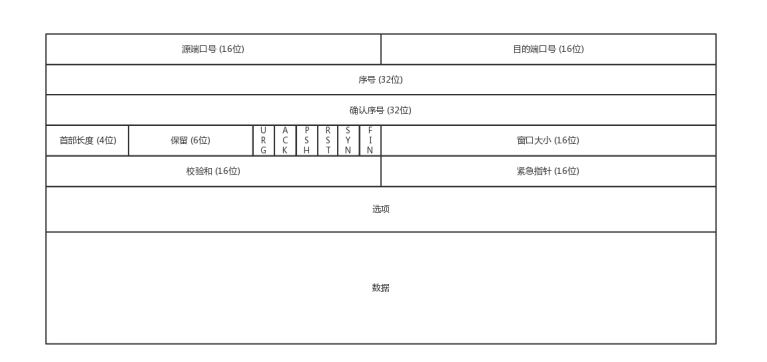
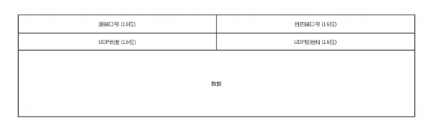

### tcp 协议 与  udp 协议

一般面试的时候我问这两个协议的区别，大部分人会回答，TCP 是面向连接的，UDP 是面向无连接的;

请说人话!

 tcp:彬彬有礼,成熟稳定的成年人

  顺序问题 ,  稳重不乱；
  丢包问题，承诺靠谱；
  连接维护，有始有终；
  流量控制，把握分寸；
  拥塞控制，知进知退。

 udp:我行我素,不管不顾,管杀不管埋,容易丢包

  顺序问题 ,  一次就一个包；
  丢包问题，我给你发货了,其他我不管；
  连接维护，爱接不接；
  流量控制，就是干；
  拥塞控制，干就完了。

再通俗一点!

tcp就像京东的服务质量好的商家,会保证发货的质量和物流,谁让你付的钱多呢,必须服务到位.

udp就像PDD我只管把商品发出去,有没有到你手上,质量如何我不保证,谁让我便宜呢,要啥自行车.

 建立连接3次握手:请求 -> 应答 -> 应答之应答
 1.A:我需要与你建立关系
 2.B:好的,我收到你的连接请求,我同意和你建立关系
 3.A:收到,那我们开始谈恋爱吧
 断开连接4次挥手
1.A:我想和你分手
2.B:好的,我同意和你分走
3.A:ok,那我们分手吧
4.B:好的分手吧

为什么是3次或者是4次,是在性能和稳定性做的一个平衡,你可以4次握手或者N次握手,但是多了浪费时间,同样挥手你也可以3次或者自己断开就一次,但是这样不稳定,每次的挥手和握手都是为了确认自己和对方的状态

#### tcp协议头组成

#### udp协议头组成

