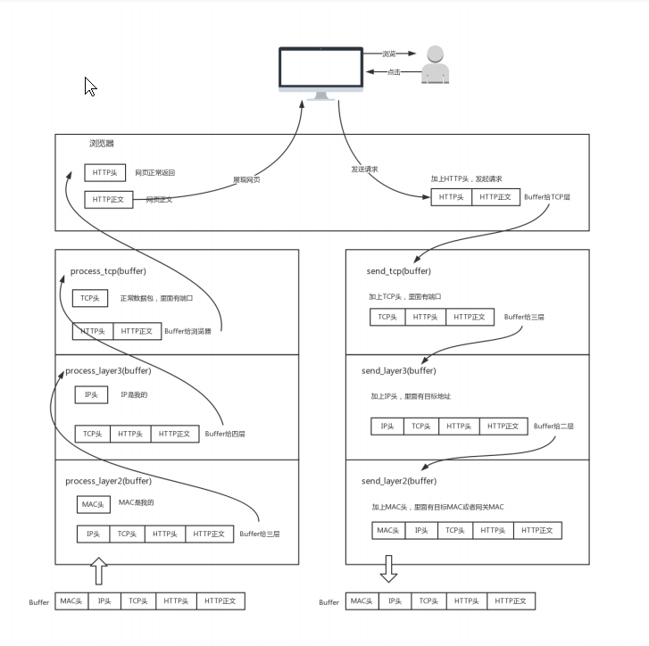

### 网络分层

如何理解网络分层呢,那要从网络分层的目的来理解

网络传输的最终目的是传出一个完整的信息,并且到达接收方,让接收方能够准确的接受并能回复.

比如在浏览器输入<https://www.baidu.com>
我们的请求体就需要添加请求内容 www.baidu.com,请求协议是 https,这里就是应用层,由应用生成
接着我们需要添加tcp头,tcp属于传输协议,属于传输层
接着我们需要添加ip头,ip属于网络协议,属于网络层
接着我们需要添加Mac头,网卡的Mac唯一地址,这就是物理层

从图中我们可以看出,接收方的顺序是和发送方相反的操作,当信息到达目的之后
写剥离mac头,然后剥离ip头,剥离tcp头,到达服务器应用后解析最终的请求

每一次tcp请求都会经过以上完整的过程
