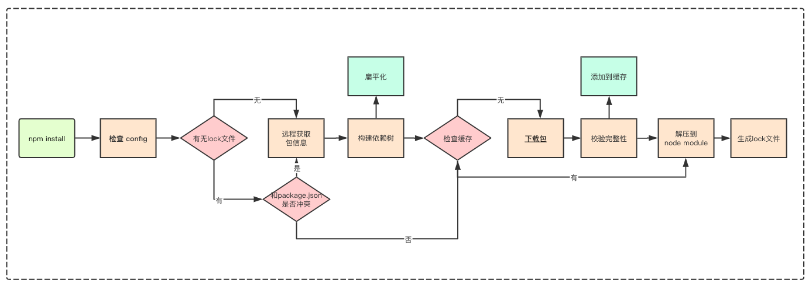

### npm install 做了什么?什么时候会更新安装包?依赖嵌套如何解决?

#### npm install 流程图可参照下图

#### 我们都知道依赖被安装到了node_modules 文件夹内

#### 那依赖的依赖安装在哪呢?

在项目的node_modules内

#### 为什么不是安装在各自安装包的node_modules内呢?

其实最早的npm是把各自包依赖都安装在各自的node_modules内,但是这样会造成很深的路径嵌套,和包的重复冗余,所以现在的安装包的结构是扁平化的,可以复用已经安装的依赖包.

#### 如果包A和包B分别依赖不同版本的依赖C,我们应该安装哪个版本的依赖C?

按照安装顺序来定,如果先安装包A,先将包A依赖的包C的版本安装到项目级的node_modules 内,包B依赖的包C则安装到包B下的node_modules 内

#### 那如何保证每次npm install 都能得到相同的安装顺序和包的版本呢?

通过package-lock.json

     {
      version：包版本 
      resolved：包具体的安装来源
      integrity：包 hash 值，基于 Subresource Integrity 来验证已安装的软件包是否被改动过、是否已失效
      requires：对应子依赖的依赖，与子依赖的 package.json 中 dependencies的依赖项相同。
      dependencies：结构和外层的 dependencies 结构相同，存储安装在子依赖 node_modules 中的依赖包。
      }

#### 包何时会更新?

依赖版本号规则

1. version
    必须匹配某个版本
    如：1.1.2，表示必须依赖1.1.2版
2. \>version
  必须大于某个版本
  如：>1.1.2，表示必须大于1.1.2版
3. ~version
   大概匹配某个版本
   如：~1.1.2，表示>=1.1.2 <1.2.0，可以是1.1.2，1.1.3，1.1.4，.....，1.1.n
4. ^version
    兼容某个版本
    版本号中最左边的非0数字的右侧可以任意,如果缺少某个版本号，则这个版本号的位置可以任意
    如：^1.1.2 ，表示>=1.1.2 <2.0.0，可以是1.1.2，1.1.3，.....，1.1.n，1.2.n，.....，
    这里要注意有的时候发布者觉得是兼容低版本的,但是事实上并不兼容的情况.